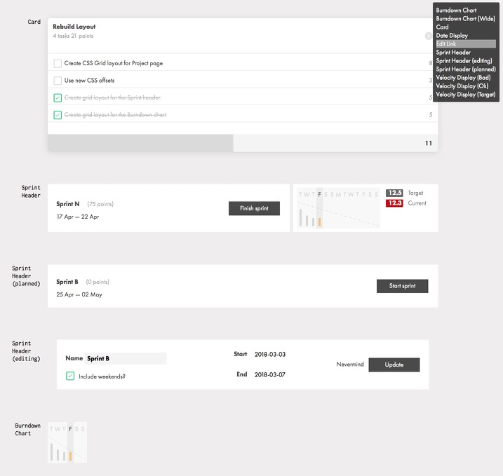

# Componentize

My way of collecting all components on a single page.



## Installation

Drop the contents of the `dist` folder into your `vendor` (maybe using a [subtree merge][submerge]?) or similar, and reference the files as you do any other JS/CSS resource. You only need them on the page you want to show your components on.

Build your components section like this:

```html
<section class="components">
	<div class="components-description">
		<!-- Any description you want to have on the page before the component list -->
	</div>
	
	<div class="component" data-title="ComponentName">
		
		<!-- Your component markup here -->
		
	</div>
	
	<!-- Additional components -->
	
</section>
```

### Helper classes

There are a couple of helper classes to put on individual components, if necessary:

- `.alt-bg` : Renders a transparent checkerboard background behind the component
- `.solid-bg` : Renders a solid color behind the component
- `.space-before`, `.space-after`, `.large-space-before` & `.large-space-after` : Makes extra room for the previous/next component (handy if a component does some position shifting, e.g. pulling an icon partly outside of the box)

When using `.solid-bg` it's possible to specify a specific background color using a **CSS Custom Property** (aka *CSS Variable*) named `--bg-color`.
Because of the way CSS Custom Properties work, you can set this variable on any ancestor (e.g. the `<body>`) element to effectively
override the default `#505050` as specified in the distributed CSS - and *still* override it on a specific component, if needed.
CSS Custom Properties can be set in a style attribute, e.g.:

```html
<div class="component solid-bg" style="--bg-color: yellow;">
	<!-- A dark, pure-CSS Batman logo that needs a yellow background maybe? -->
</div>
```

The `componentize.js` script renders a *Table Of Contents* layer on the right side of the screen, where all the components are listed in alphabetical order, clickable of course :)
It also adds a textbox for live-filtering the components on the page.

[submerge]: http://greystate.dk/resources/subtree-merge/?rf=dist&u=greystate&b=master&r=componentize&lf=vendor/componentize
