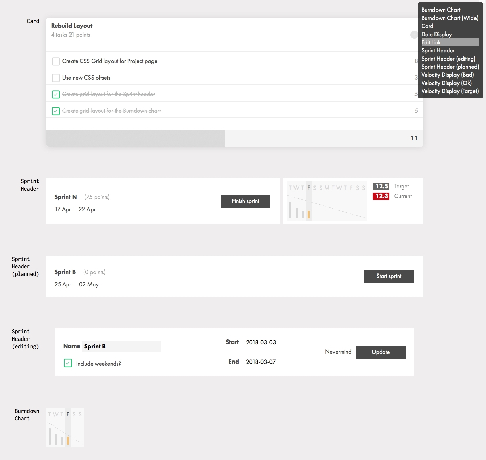

# Componentize

My system of building components for at website.



## Installation

Drop the contents of the `dist` folder into your `vendor` or similar, and reference the files as you
do any other JS/CSS resource. You only need them on the page you want to show your components on.

## Usage

Build your components section like this:

```html
<section class="components">
	<div class="components-description">
		<!-- Any description you want to have on the page before the component list -->
	</div>

	<component-viewer label="Component Name">
		<!-- Your component markup here -->
	</component-viewer>

	<!-- Additional components -->

</section>
```

### Component States and/or Modifiers

Sometimes a component exist in a couple of variations, which can be expressed with CSS classes
you can list these in a `states` attribute to have the component automatically present radiobuttons
for them, e.g.:

```html
<component-viewer label="Spinner" states="paused,running">
	<div class="spinner paused">[°•°°°°]</div>
</component-viewer>
```

You can add a *no-state* state as well, by adding `nil` to `states`, e.g.:

```html
<component-viewer label="Spinner" states="nil,paused,running">
	<div class="spinner paused">[°•°°°°]</div>
</component-viewer>
```

Modifiers works in a similar fashion, except they're represented by checkboxes.
So it's possible to have one or many modifiers selected at a time, but only a single state at any
time. They're specified with the `modifiers` attribute:

```html
<component-viewer label="Card" modifiers="inverse,hi-contrast">
	<div class="card">...</div>
</component-viewer>
```


### Helper classes

There are a couple of helper classes to put on individual components, if necessary:

- `.alt-bg` : Renders a transparent checkerboard background behind the component
- `.solid-bg` : Renders a solid color behind the component
- `.space-before`, `.space-after`, `.large-space-before` & `.large-space-after` : Makes extra room for the previous/next component (handy if a component does some position shifting, e.g. pulling an icon partly outside of the box)
- `.limit-half` & `.limit-third` : Makes sure the component only takes up half (or a third) of the available space in the inline direction (useful for card components that would otherwise fill the screen).

When using `.solid-bg` it's possible to specify a specific background color using a **CSS Custom Property** (aka *CSS Variable*) named `--component-bgcolor`.
Because of the way CSS Custom Properties work, you can set this variable on any ancestor (e.g. the `<body>`) element to effectively
override the default `#505050` as specified in the distributed CSS - and *still* override it on a specific component, if needed.
CSS Custom Properties can be set in a style attribute, e.g.:

```html
<component-viewer label="Batlogo" class="solid-bg" style="--component-bgcolor: yellow;">
	<!-- A dark, pure-CSS Batman logo that needs a yellow background maybe? -->
</component-viewer>
```

The `componentize.js` adds some nice enhancements:

- Renders a *Table Of Contents* layer on the right side of the screen, where all the components are
  listed in alphabetical order, clickable of course :)
- Adds a textbox for live-filtering the components on the page.
- Adds state & modifier controls for components that has `data-states` / `data-modifiers` attributes

